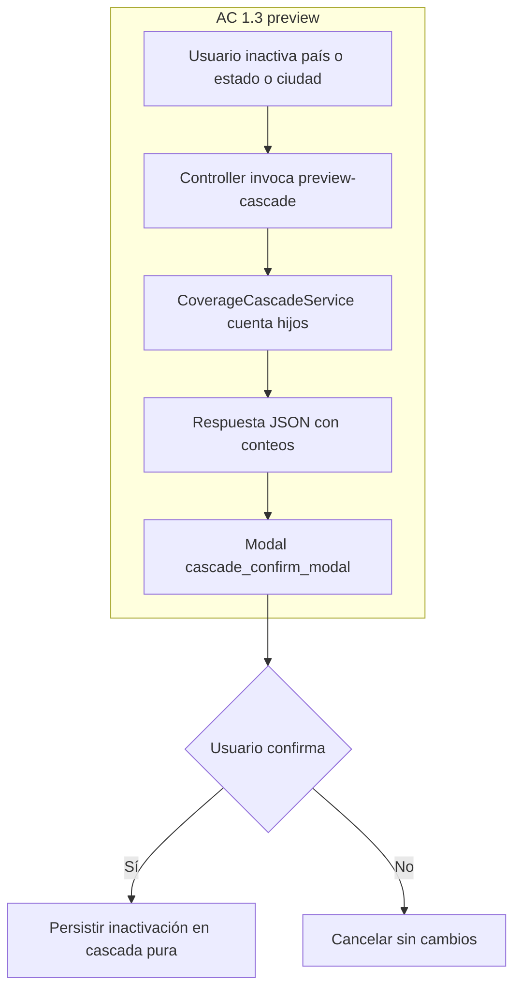
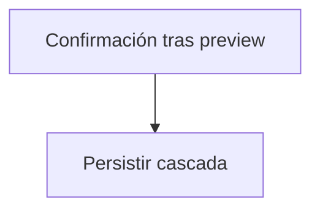

# Plan de cobertura de negocio LIF-16 (alcance podado a Jira)

## Audit: qué queda fuera y por qué

Los siguientes artefactos del plan histórico amplio **no tienen respaldo en ningún AC del Jira (1.1 → 5.3)** y se excluyen del alcance de este documento. Entre paréntesis se cita el ítem del Confluence que los justificaba y por qué sobran respecto a Jira.

1. **Columnas `postal_code`, `shipping_rate`, `special_coverage` en `cities`** (Confluence ítem 5 "Atributos adicionales por ciudad"). No hay AC del Jira que pida atributos logísticos de ciudad.
2. **Columna `timezone` en `countries`** (Confluence ítem 5). Idem.
3. **Columnas `is_default` en `states` y `cities`** (derivado del Confluence). Jira solo habla de `is_default` para país (AC 3.1, 3.3).
4. **`CoverageDependencyChecker` y tablas de 8 dependencias** (`pickup_locations`, `cost_centers`, `customer_profiles`, `customer_financial_profiles`, `guest_order_details`, `order_address_details`, `general_settings`, `cat_denominations`). Derivados del Confluence ítem 4 "Restricción de eliminación con dependencias". El Jira no contempla bloqueo por dependencias.
5. **Test `CoverageDependencyTest`**. Depende del DependencyChecker.
6. **Fase histórica de import/export: `CoverageImportExportController`, `Exports/`, `Imports/`, rutas `import`/`export`, botones UI y `CoverageImportExportTest`** (Confluence ítem 6). Jira no pide import/export.
7. **Permisos `setup.country.import`, `setup.country.export`, `setup.state.import`, `setup.state.export`, `setup.city.import`, `setup.city.export`, `setup.city.logistics`**. Asociados a features fuera de scope.
8. **Endpoint `POST /setup/location/city/dependencies/{id}`**. Depende del DependencyChecker eliminado.
9. **Referencia en el Mermaid al nodo `DependencyChecker`** y su rama de "confirmación forzada". Queda solo la cascada pura.
10. **Validaciones `postal_code`, `shipping_rate:numeric|min:0`, `special_coverage:boolean` en `StoreCityRequest`/`UpdateCityRequest`**. Dependen de columnas eliminadas.
11. **Validación `timezone: in:DateTimeZone::listIdentifiers()` en `Store/UpdateCountryRequest`**. Depende de columna eliminada.
12. **Carpetas `Exports/` e `Imports/`** en la estructura de archivos.
13. **Del checklist de QA:** ítem "Import/export CSV y XLSX…" e ítem "Bloqueo de inactivación por dependencias…". No respaldados por ACs del Jira.
14. **De "Escenarios de integración reservados a QA":** "Carga masiva real con archivo CSV/XLSX…" (import/export fuera de scope).
15. **Del Seeder `CoverageDefaultsSeeder`:** cualquier línea que setee `timezone` (columna fuera de scope). Se conserva la parte de `status=0` para todos los países excepto Colombia y `is_default=true` en Colombia, porque son respaldadas por AC 3.1 + sección "Configuración Inicial (Seed Data)" del Jira.

## Cobertura de ACs tras la poda

Todos los ACs del Jira siguen cubiertos con el alcance reducido. Mapeo verificado:

- **AC 1.1, 1.2, 1.3** → `CoverageCascadeService` + `preview-cascade` + `cascade_confirm_modal.blade.php`.
- **AC 2.1, 2.2, 2.3** → `activateCity` / `activateState` con validación ascendente.
- **AC 3.1, 3.2** → `DefaultLocationGuard` + `CountryRepository::activeCountLocked()` + seeder Colombia.
- **AC 3.3** → `toggle-default` con transacción que limpia hermanos + permiso `setup.country.default`.
- **AC 4.1** → `StoreCountryRequest` unique case-insensitive de `code` y `name`.
- **AC 4.2** → `StoreCityRequest` unique `name + state_id` a nivel Form Request (`Rule::unique('cities','name')->where('state_id', $id)`).
- **AC 4.3** → regex `^\+?[0-9]+$` en `phonecode`.
- **AC 4.4** → `mimes:jpg,png|max:200` + regla `FlagDimensions` (p. ej. 61×36).
- **AC 5.1, 5.2** → Yajra DataTables server-side con ordenamiento + búsqueda instantánea.
- **AC 5.3** → tooltip server-side en `status_td`.

No se agregan artefactos nuevos fuera de este mapeo.

## Decisiones de arquitectura (resumen)

- **Cascada:** un servicio único orquesta inactivación en cascada y el conteo previo para el modal; sin comprobación de dependencias de negocio ajenas a la jerarquía país → estado → ciudad.
- **País por defecto:** un guard centraliza reglas de último país activo y el toggle de `is_default` con exclusión mutua.
- **Unicidad ciudad:** sin columna generada ni DDL `UNIQUE` raw sobre `name` traducible; unicidad funcional AC 4.2 solo en Form Request.

## Diagrama de flujo (cascada, sin DependencyChecker)



Equivalente mínimo respecto al plan legacy (sustituye el subárbol `DependencyChecker` / dependencias externas):



La rama eliminada del plan antiguo era: `DependencyChecker` → decisión por dependencias externas → confirmación forzada o bloqueo. **Esa rama no existe en el alcance Jira:** el flujo va de la confirmación del preview directamente a la persistencia de la cascada (`E --> L`).

## FASE 1 — Migraciones y entidades

**Objetivo:** alinear esquema y modelos a los AC sin columnas de Confluence fuera de ticket.

**Migración (ejemplo orientativo en Laravel):**

- `Schema::table('countries', …)`:
  - Añadir `$table->boolean('is_default')->default(false)->after('status');` si no existe.
  - Índices: `$table->index('status');`, `$table->index('is_default');`.
  - **No** añadir `timezone`.
- `Schema::table('states', …)`:
  - **Solo** índice compuesto `$table->index(['country_id', 'status']);`.
  - **No** añadir `is_default`.
- `Schema::table('cities', …)`:
  - **Solo** índice `$table->index(['state_id', 'status']);`.
  - **No** añadir `is_default`, `postal_code`, `shipping_rate`, `special_coverage` ni `unique(..., 'name(191)')` en DDL.

**Nota AC 4.2:** La unicidad `name + state_id` se valida a nivel `Rule::unique('cities','name')->where('state_id', $id)` en el Form Request (sin columna generada ni DDL raw).

**Modelos a actualizar:**

- **`Country`:** `fillable` / `casts` incluyen `is_default`; scopes `active()`; métodos de apoyo para último activo y default según AC 3.x.
- **`State`:** scope `active()` únicamente (sin `is_default`).
- **`City`:** scope `active()` únicamente (sin campos logísticos ni `is_default`).

**Referencia en repo:** migración [`Modules/Setup/Database/Migrations/2026_04_17_150000_add_coverage_attributes_to_locations.php`](../../Modules/Setup/Database/Migrations/2026_04_17_150000_add_coverage_attributes_to_locations.php); entidades en [`Modules/Setup/Entities/`](../../Modules/Setup/Entities/).

### Validación de Fase 1 (entorno local)

Tras aplicar migraciones, el esquema esperado incluye `countries.is_default` y **no** incluye `countries.timezone` ni columnas logísticas en `cities`. Ejemplo de verificación: `Schema::getColumnListing('countries'|'states'|'cities')` debe alinearse con el listado anterior.

---

## FASE 2 — Servicios

- **`CoverageCascadeService`:** preview de hijos afectados; aplicación de inactivación en cascada descendente; integración con respuestas para el modal (AC 1.1–1.3).
- **`DefaultLocationGuard`:** impedir inactivar el último país activo con mensaje acordado; helper para fijar `is_default` limpiando hermanos (AC 3.1–3.2; apoyo a 3.3 en capa de aplicación).
- **`CountryRepository`:** métodos necesarios p. ej. `activeCountLocked()` para condiciones de bloqueo/transacción según AC 3.x.
- **Activación ascendente:** en servicios o repositorios de `State`/`City`, validar que padre esté activo antes de permitir `status=1` (AC 2.1–2.3).

**Excluido:** `CoverageDependencyChecker` y cualquier conteo contra `pickup_locations`, `cost_centers`, `customer_profiles`, `customer_financial_profiles`, `guest_order_details`, `order_address_details`, `general_settings`, `cat_denominations`.

**Subtareas de tests (Feature):**

- `CoverageCascadeTest.php` — AC 1.1, 1.2, 1.3, 2.1, 2.2, 2.3.
- `DefaultCountryGuardTest.php` — AC 3.1, 3.2, 3.3.
- **No** incluir `CoverageDependencyTest.php`.

---

## FASE 3 — Controllers, rutas y Form Requests

- Endpoints de **preview** y **aplicar cascada** (nombres exactos al estándar del módulo) bajo prefijo `setup` + middleware `permission`/`auth` según patrón existente.
- Endpoint **toggle-default** para país (AC 3.3) con permiso `setup.country.default`.
- **No** añadir `POST /setup/location/city/dependencies/{id}`.
- **No** añadir rutas `import` ni `export` (ni referencias a una "fase" de importación en documentación interna).

**Form Requests:**

- `StoreCountryRequest` / `UpdateCountryRequest`: reglas para `code`, `name`, `phonecode`, `flag`, `status`, `is_default`; **sin** `timezone`.
- `StoreCityRequest` / `UpdateCityRequest`: unique compuesto `name + state_id`; **sin** `postal_code`, `shipping_rate`, `special_coverage`.

Archivos típicos: [`CountryController.php`](../../Modules/Setup/Http/Controllers/CountryController.php), [`StateController.php`](../../Modules/Setup/Http/Controllers/StateController.php), [`CityController.php`](../../Modules/Setup/Http/Controllers/CityController.php), [`web.php`](../../Modules/Setup/Routes/web.php) — **comentario de mantenimiento:** agregar rutas de cascade y default (no import/export).

---

## FASE 4 — Vistas y JS

- **País:** formularios create/edit con switch/checkbox `is_default` según diseño actual del backend; **sin** select `timezone`.
- **Ciudad:** **sin** campos `postal_code`, `shipping_rate`, `special_coverage`.
- **Listados / DataTables:** orden dinámico y búsqueda rápida (AC 5.1, 5.2).
- **`status_td` (ciudad/estado/país según aplique):** tooltip o indicador para inactivos por cascada (AC 5.3); integración con preview de cascada en la columna de estado donde corresponda.
- **Modal:** `cascade_confirm_modal.blade.php` (o equivalente) enlazado al flujo preview → confirmar → POST cascada.
- **`menu.blade.php`:** al añadir entradas de menú, **no** verificar permisos de import/export (no existen en este plan).

---

## Import/Export CSV-XLSX (fuera de alcance LIF-16)

Import/Export CSV-XLSX **no está respaldado por ningún AC del Jira** (proviene del Confluence ítem 6). Queda **fuera de scope** de LIF-16; documentar en backlog como ticket independiente si el negocio lo requiere.

---

## FASE 5 — Seeders y permisos

- **`CoverageDefaultsSeeder`:** asegurar datos iniciales según Jira: p. ej. todos los países con `status=0` excepto Colombia; **`is_default=true` solo en Colombia**; **no** setear `timezone`.
- **Migración o seeder de permisos:** añadir únicamente el permiso relevante para marcar país por defecto: `setup.country.default`. **No** registrar permisos de import/export ni `setup.city.logistics`.

---

## FASE 6 — Integración y QA técnico

- Ejecutar baterías `CoverageCascadeTest`, `DefaultCountryGuardTest`, ampliaciones en `CountryTest` / `CityTest` según AC 4.x.
- Browser tests opcionales para AC 5.1 y 5.2 (orden y búsqueda).
- Revisar traducciones de mensajes de error para AC 2.3 y 3.2 (texto exacto según Jira).

---

## FASE 7 — Coordinación con QA

Checklist alineado **solo** a ACs **1.1 → 5.3** del Jira:

- [ ] AC 1.1 — Cascada descendente al inactivar País (`CoverageCascadeTest`).
- [ ] AC 1.2 — Cascada descendente al inactivar Estado (`CoverageCascadeTest`).
- [ ] AC 1.3 — Modal previo con conteo de hijos afectados (preview-cascade + feature test).
- [ ] AC 2.1 — Bloqueo al activar Ciudad con Estado o País inactivo (`CoverageCascadeTest`).
- [ ] AC 2.2 — Bloqueo al activar Estado con País inactivo (`CoverageCascadeTest`).
- [ ] AC 2.3 — Mensaje de error localizado con nombre del nivel superior (`CoverageCascadeTest`).
- [ ] AC 3.1 — `is_default` en Colombia y protección mientras sea único activo (`DefaultCountryGuardTest`).
- [ ] AC 3.2 — Bloqueo al inactivar el último país activo con mensaje exacto (`DefaultCountryGuardTest`).
- [ ] AC 3.3 — Unicidad simultánea de `is_default`; al marcar nuevo, el anterior pierde la propiedad (`DefaultCountryGuardTest`).
- [ ] AC 4.1 — Unique case-insensitive de código ISO y nombre de país (`CountryTest` ampliado).
- [ ] AC 4.2 — Unique `name + state_id` en ciudades (`CityTest` ampliado).
- [ ] AC 4.3 — Regex `phonecode` admite solo dígitos y "+" (`CountryTest` ampliado).
- [ ] AC 4.4 — Bandera rechaza archivos no jpg/png o > 200 KB; `FlagDimensions` 61×36 (`CountryTest` ampliado).
- [ ] AC 5.1 — Orden dinámico por columna sin recarga (browser test + feature según estrategia).
- [ ] AC 5.2 — Búsqueda rápida filtra instantáneamente (browser test).
- [ ] AC 5.3 — Tooltip/indicador para registros inactivos por cascada (`status_td` Blade).

**Escenarios de integración reservados a QA:** pruebas manuales en flujo real con roles de administración; **excluir** carga masiva con CSV/XLSX (fuera de scope).

---

## Riesgos y mitigaciones

- **Concurrencia al togglear `is_default`:** usar transacción con bloqueo pesimista/optimista en filas de `countries` según patrón del proyecto.
- **Nombre traducible en `cities`:** la unicidad AC 4.2 vive en capa de validación; documentar limitaciones si el JSON traducible requiere reglas adicionales en el futuro.
- **Rendimiento DataTables:** índices `(country_id, status)` y `(state_id, status)` mitigan filtros por estado activo.

**Riesgos eliminados del plan antiguo (ya no aplican):** unique DDL complejo para `name` JSON en `cities`; tratamiento de `order_address_details` como string para DependencyChecker.

---

## Estructura de archivos (reducida, módulo Setup)

Rutas relativas al módulo [`Modules/Setup/`](../../Modules/Setup/):

```text
Modules/Setup/
├── Database/
│   ├── Migrations/
│   │   ├── ..._add_coverage_attributes_to_locations.php
│   │   └── ..._add_setup_country_default_permission.php   # solo permiso setup.country.default
│   └── Seeders/
│       └── CoverageDefaultsSeeder.php
├── Entities/
│   ├── Country.php          # active, is_default, isLastActive, isDefault
│   ├── State.php            # scope active()
│   └── City.php             # scope active()
├── Http/
│   ├── Controllers/
│   │   ├── CountryController.php
│   │   ├── StateController.php
│   │   └── CityController.php
│   └── Requests/
│       ├── StoreCountryRequest.php / UpdateCountryRequest.php
│       ├── StoreCityRequest.php / UpdateCityRequest.php
│       └── ... (otros requests existentes del módulo)
├── Repositories/
│   └── CountryRepository.php   # activeCountLocked(), etc.
├── Resources/views/
│   ├── menu.blade.php
│   └── location/
│       ├── country/components/   # create, edit, list, scripts — is_default; preview cascade en flujos que apliquen
│       ├── state/components/
│       └── city/components/      # status_td: tooltip cascada
├── Routes/
│   └── web.php                 # rutas cascade + default
├── Services/
│   ├── CoverageCascadeService.php
│   └── DefaultLocationGuard.php
└── Tests/Feature/
    ├── CoverageCascadeTest.php
    ├── DefaultCountryGuardTest.php
    ├── CountryTest.php
    └── CityTest.php
```

**No** se crean: `Exports/`, `Imports/`, `CoverageImportExportController.php`, `CoverageDependencyChecker.php`, `CoverageDependencyTest.php`, `CoverageImportExportTest.php`.

**Adicionales fuera de `Modules/Setup`:** solo si el proyecto centraliza permisos en otro módulo; en ese caso una migración allí comentada como "solo `setup.country.default`".

---

## Mapeo contra criterios de aceptación del Jira

| AC | Implementación prevista |
|----|-------------------------|
| 1.1 | Cascada al inactivar país |
| 1.2 | Cascada al inactivar estado |
| 1.3 | Preview + modal con conteos |
| 2.1–2.3 | Activación ciudad/estado con validación de padres + mensajes |
| 3.1–3.3 | Seeder + guard + toggle default + transacción |
| 4.1 | Unique insensible a mayúsculas país |
| 4.2 | Unique ciudad a nivel Form Request con `Rule::unique('cities','name')->where('state_id', $id)` |
| 4.3 | Regex phonecode |
| 4.4 | Flag tipo/tamaño + dimensiones |
| 5.1–5.2 | DataTables |
| 5.3 | Tooltip `status_td` |

---

## Diferencias detectadas entre Jira y Confluence

Los siguientes requisitos aparecen en el Confluence pero **no** están en ningún AC del Jira. Quedan fuera del scope de LIF-16; consultar con el tech lead si surgen durante la implementación:

1. Atributos logísticos por ciudad (zona horaria, código postal, tarifa de envío, cobertura especial) — Confluence ítem 5.
2. Importación y exportación CSV/XLSX de países, estados y ciudades — Confluence ítem 6.
3. Bloqueo de eliminación por dependencias activas (clientes, pedidos, centros de distribución) con alertas detalladas — Confluence ítem 4.
4. Notificación anual obligatoria para que los empresarios actualicen su información — Confluence ítem 9 (ya trasladada a backlog).
5. Restricción explícita de permisos a "configuración logística o del sistema" para crear/editar/eliminar — Confluence ítem 1 (Jira no define el conjunto de roles explícito).

---

*Id. documento: `5a804c02` — alineado a poda LIF-16 / Jira AC 1.1–5.3.*
